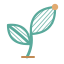

# Tangent Garden



Grow a little mathematical wonder.

An interactive mathematical art notebook for **evolutes, involutes, catacaustics, diacaustics, pedals, contrapedals, orthotomics, offsets, rolling circles, rolling curves, line, chord, and circle envelopes, and circle inversions**. Enter a planar curve and explore both the derived curve and the lines that construct it. Inspired by hobby Maple worksheets from around 2006, independently reworked and validated with numerical geometry.

Go computes the geometry in a browser Web Worker through WebAssembly. React and TypeScript provide the controls; SVG draws the curves. The result is a static website with no application server, account, telemetry, or remote computation.

## Features

- Parametric, Cartesian, and polar curve definitions, with a bounded expression parser and constants such as `pi`, `e`, and `phi`.
- Roulettes traced by a circle rolling inside or outside a fixed circle or along a line, with the rolling circle drawn, exact closure for rational radius ratios, and radius, tracing-distance, and phase animation.
- A circle rolling without slipping along any regular curve, on either side, rolling back out of cusps, with its contact normals, rolling circle, and radius, tracing-distance, and phase animation.
- A second curve rolling without slipping along the curve, with arc-length contact matching, wrapping for closed rolling curves, explicit stops at open ends and its own cusps, rolling back out of the base's cusps, and tracing-point and start animation.
- Envelopes of line families, each line through the curve at a direction angle θ(t) or a chord to a second moving point, with coincident endpoints left as gaps, chord extensions dashed, and multiplier animation through `a`; and envelopes of moving circles of radius R(t), with both real branches, their mergers, and gaps where the circles nest.
- Inversion in a circle, with the circle, correspondence segments, images left open where they run off to infinity, and center and radius animation.
- Every construction built on the curve or on its evolute, pedal, contrapedal, orthotomic, or offset, evaluated from the curve's definition rather than a polyline: a pedal of a pedal, a circle rolling on an evolute, the involute of an evolute, an inverted pedal. Combinations that would need a fourth derivative are refused, and constructions that follow the direction of travel are left open at cusps.
- Lissajous figures and Fourier curves of up to 16 rotating vectors, drawn with their guide circles or chained epicycles, with closure reported exactly for whole-number frequency ratios and never forced otherwise, and animation of every amplitude, frequency, radius, and phase.
- Cyclic pursuit of 2–16 pursuers at their own speeds, integrated with adaptive error control, drawn with every path and the connecting polygons, and stopped explicitly at the first capture.
- Vector-field trajectories from 1–16 seeds, integrated with adaptive error control and explicit escape, singularity, and step-budget ends, with the direction field of an autonomous field.
- Implicit curves F(x, y) = c and families of levels, traced on a bounded grid with exact crossings, deliberately decided saddle cells, poles and jumps told apart from zero crossings, and adaptive refinement, drawn with F's gradient.
- Iterated maps (Clifford, Peter de Jong, Hénon) drawn as the logarithmic visit density of their orbits on a bounded grid, never joined into curves, with escapes counted.
- Forty-seven example studies; point and parallel light sources; polar source coordinates; configurable refraction.
- Independent poles for pedal, contrapedal, and orthotomic constructions, with tangent/normal projections, reflected segments, and pole-coordinate animation.
- Signed normal offsets (parallel curves) that keep their cusps and swallowtails, with distance animation, evenly spaced offset stacks, and optional generating circles whose envelope is the offsets ±R.
- Construction lines, virtual rays, singularity diagnostics, pan/zoom, and light/dark themes.
- A curvature probe at any sample: tangent, normal, osculating circle and center of curvature, the point's construction lines, signed curvature, radius and arc length read out and plotted, moving along the curve as an animation or held while parameters vary, and drawn where you put it while the curve is drawn or light is traced; an example traces sunlight in an oval mirror to the caustic, which the probe's ray reaches a quarter of the way along its chord of the osculating circle.
- Optional refinement between samples, inserting points where a chord strays from the curve, the curve built on, and a pedal-type, evolute, offset (every member of a stack), caustic or inverted curve, involute, rolling trace, or envelope of lines, chords or circles (each circle branch on its own), with gaps and poles found between samples left open and the real and virtual parts of a caustic or chord envelope meeting where they change.
- Line weights in every notebook: fine, regular, bold, or one-pixel hairlines, live and in every export.
- Curve-reveal and multi-parameter animations with four camera modes.
- **Copy link** in every notebook: a link that reopens your study, layers, view, and animation setup for anyone, carried in the URL fragment with no server.
- PNG and vector SVG image exports, and for 3D studies a vector line drawing of every line or of the lines not hidden by a surface, with hidden ones faint or dashed if chosen; animation exports as MP4 video (the default) or animated WebP, whichever the browser can encode, with resolution, quality, and up to 60 fps; every notebook can repeat an animation once, as a checked seamless loop, or back and forth, at a steady or eased pace.
- Exact sample and construction-line counts, and an engine designed for independent mathematical testing.

See the **[usage guide](docs/usage.md)** for controls, examples, animations, camera behavior, and export limits.

## Run locally

Requires **Go 1.26+**, **Node 22.12+**, npm, and Make. CI uses the latest stable Go and Node 22 on Linux. A modern browser with WebAssembly is required; WebP export additionally needs canvas WebP encoding. Browser integration tests currently target Chromium.

```sh
make install
make dev
```

Open the localhost URL printed by Vite. To try the app on a phone or tablet, run `make dev-lan` instead and open the Network URL it prints from a device on the same network; it serves to anything that can reach your machine, so use it only on a network you trust. Browsers give plain-HTTP addresses other than localhost no secure context, so animation export (which needs the video encoder) may be unavailable there. Go changes require `make wasm` and a browser refresh; frontend changes reload automatically. Native Go tests need no npm dependencies. On Windows, use WSL or another environment providing Make and a POSIX shell.

## Verify and contribute

```sh
make format       # gofmt and Prettier
make check        # formatting, vet, race/coverage tests, WASM, types, production build
npx playwright install chromium
make test-browser # builds and tests the production app
npx playwright install webkit
make test-webkit  # Safari/iOS engine checks (tests/webkit.spec.ts)
```

On Linux, Playwright may also need system libraries: `npx playwright install --with-deps chromium`. CI installs those dependencies. MP4 export tests also decode files with `ffprobe` from [FFmpeg](https://ffmpeg.org/) when it is installed; CI installs it, and local runs without it skip only those checks. `make test-webkit` runs the WebKit-specific export checks; CI runs them on a macOS runner, since Safari and every iOS browser use WebKit, with its own video encoder and no canvas WebP. Additional targets include `make test-go`, `make test-wasm`, `make typecheck`, and `make clean` (generated build artifacts only). `make bench` times the largest implicit surfaces through the WASM engine; `make bench ARGS="--compare https://tangent-garden.isaacvelando.com/"` times the deployed engine beside the local one (see [architecture](docs/architecture.md), **Measuring**).

Commit source, tests, docs, and `package-lock.json`; dependency directories, build output, browser reports, and generated WASM/runtime files are ignored. Read [AGENTS.md](AGENTS.md) for contribution boundaries and verification expectations; [CLAUDE.md](CLAUDE.md) points to the same instructions. Proposals, fixes, and tests should respect the mathematical-art focus.

## Build and host

```sh
make build        # creates dist/
make preview      # serves that build locally
make share-card   # re-renders the link-preview card and home-screen icon into public/
make thumbnails   # re-draws the example gallery's thumbnails into web/examples/
```

Serve **the contents of `dist/`** over HTTP(S), preserving its structure. Use the whole directory, including `engine.wasm`, `wasm_exec.js`, the logo, and the license/notice files. No server-side computation is needed. Relative asset URLs support hosting beneath a path prefix. Do not open the site using `file://`.

The build pairs the Go WASM runtime with the installed compiler and checks the resulting distribution for its required assets and notices. Static-host compression is useful for the several-megabyte WASM module.

The live site is **https://tangent-garden.isaacvelando.com**. Every push to `main` that passes verification deploys the tested `dist/` there, through the `production` environment. Browser smoke tests (`tests/smoke.spec.ts` and `tests/share.spec.ts`) then check the live site. Run them yourself with `BASE_URL=https://tangent-garden.isaacvelando.com npx playwright test --grep @smoke`. A failed run on `main` opens a "Production deploy failed" issue. Serve these headers wherever you host it:

- **Content-Security-Policy:** the value in [`deploy/content-security-policy.txt`](deploy/content-security-policy.txt). `make preview` sends it too, so the browser tests run under it.
- **Content type:** serve `engine.wasm` as `application/wasm`.

`404.html` links to `/`, so it assumes the site is at the root of its host.

A shared link unfurls into a card (Open Graph and Twitter tags in `index.html`) showing `public/og-image.png`. Those tags and the canonical link name the production URL, since link scrapers need absolute URLs; change them if you host it elsewhere. The card and `public/apple-touch-icon.png` are rendered from the built site by `make share-card` and committed; re-render them, check them by eye, and commit when the site's look changes.

## Spatial curves and constructions

Choose **3D studies** from the study dropdown in the notebook header. Both studies stay on the same page, retaining their controls and manual camera when you switch. `?study=3d` opens directly to the spatial notebook.

Explore tangent developables, folded sheets swept out by a space curve's straight tangent lines, and involutes, filaments traced by taut strings unwound from the curve from a chosen anchor, singly or as a family. Start with Trefoil, Cinquefoil, Woven orbit, a helix, a spatial Lissajous curve, a helix unwinding into stacked spirals, or a knot shedding filaments. Project an independent 3D pole onto the tangent lines to trace a tangent-foot curve, or rotate it half a turn around each tangent to trace a tangent-line orthotomic. Two more examples show these constructions on a trefoil and a helix. Invert the curve, or one of those tangent projections, in a sphere: space turns inside out around the sphere's center, and a curve passing through the center opens out through infinity. Build a developable, involutes, a framed ribbon, a ruled surface, or a tube on the tangent-foot curve or orthotomic instead of the curve itself: the construction follows the derived curve and stops at its cusps, as in Filaments off a cusp, A horn of perpendicular feet, and Chords across a knot's reflection. Or build them on one of the curve's involutes, unwound from its own anchor and string length, whose tangents are the curve's principal normals: three examples show a helix's tangents landing on one flat spiral, a trefoil's string unwound, and a sheet of Viviani's normals. Three examples draw a helix into its sphere, turn a trefoil inside out, and invert a knot's tangent feet. Use the torus generator, enter your own `x(t)`, `y(t)`, and `z(t)` expressions, domain, and shape parameter `a`, or chain up to eight turning vectors into a harmonic curve and watch its generating vectors and ellipses; three examples show a harmonic trefoil, tilted ellipses, and an orbit that never closes. Carry a rotation-minimizing frame (or a Frenet frame, as a diagnostic) along any of these curves to hang a twisted ribbon and up to twelve offset strands from it; on a closed loop the frame can return turned, and that seam is shown or evenly corrected, never hidden. Three examples show a band around the trefoil, strands braided on a helix, and the seam of a carried frame. Join the curve to itself (chords) or to a second thread by straight rulings, under an explicit correspondence `mt + δ`, to weave a ruled surface; three examples show a harmonic loom, chords across the trefoil, and chords of a rising helix. Roll spheres along the curve to draw their envelope, a tube of constant radius or a canal surface whose radius follows a profile ρ(t); where the radius changes faster than the centre moves the envelope vanishes and is left open, and folds are drawn, never trimmed. Three examples show a tube around the trefoil, a necklace of spheres, and beads that lose their envelope. Follow a vector field `r′ = V(x, y, z, t)` from up to twelve seeds, each trajectory integrated on its own and stopped explicitly where it escapes a sphere or the field fails, and show the trajectories alone or build any construction on the first; three examples show a rising vortex, Lorenz's two wings, and a ribbon along Rössler's band. Chase pursuers around a cycle in space, each running straight at the next until the first capture stops them all; three examples show four pursuers spiralling down a paraboloid from a tetrahedron, a chase untangling a trefoil, and a crown of six with a tangent ribbon. Study a surface instead of a curve: an ellipsoid or sphere, a torus, an elliptic cylinder, a paraboloid or saddle, or a monkey saddle, with its normal lines, a signed offset surface, and its two focal sheets of centres of curvature. Sheets that collapse to a curve or a point are drawn and labelled as such, a sheet is never joined through infinity, and chart singularities and umbilics are counted; four examples show a torus revealing its centers, a sphere collapsing to one focus, the focal sheets of an ellipsoid, and an elliptic cylinder and its evolute. Light one of those surfaces as a mirror, with parallel light or a point source, and follow a single reflection to its caustics, real ahead of the mirror or virtual behind it, never joined through infinity; five examples show a paraboloid gathering light, a tilted beam folding into coma, a spherical bowl's cusped caustic, an ellipsoid refocusing its lamp, and a cup's nephroid. Make the surface an interface between two media instead and refract the light once by Snell's law, with total internal reflection counted and shown; and catch the outgoing light on a receiver plane whose bins show irradiance, with every share of the light accounted for; four examples show a glass ellipsoid focusing a beam, a glass dome's ring of light, a lamp in water over air, and a cup's nephroid on its floor. Or define a surface implicitly, as the level set F(x, y, z) = c of your own expression inside a box, meshed with exact vertices and a note that reads its topology (its pieces, whether each is closed, and its genus) and marks poles, jumps and undefined regions instead of meshing across them. Refine the mesh up to three levels, crack-free, where samples between grid points disagree with it, to find necks and gaps thinner than a cell. Cut it with a family of planes in section curves traced as the 2D notebook traces implicit curves. Nine examples show a sphere and its latitudes, the spiric sections of Perseus, Villarceau circles, two drops meeting, a double torus, the tanglecube, a gyroid cut open, a thread between two drops, and a Klein bottle passing through itself. Probe any curve study at a point to see its Frenet frame, osculating circle and that point's construction lines, with its curvature and torsion read out and plotted along the whole curve; where the curve is flat, the frame and torsion are marked undefined rather than guessed, and an animation can move the probe along the whole curve, or keep it on the curve while parameters reshape it, as in A helix pressed through its circle, A twisted cubic losing its bend, A trefoil breathing under a moving probe and A knot reparameterized in place. A reveal, an orbit, a flight, traced light and a peel draw the probe where you put it, and one example circles a trefoil to show its osculating circle face on, then edge on. Probe a surface patch, or a canal, tangent developable, framed ribbon or ruled surface, the same way, to see its two principal directions, curvatures and centres of curvature at a point, with the Gaussian and mean curvatures: a tangent developable reads K = 0 everywhere, and a ribbon or ruled surface never curves positively. Probe a mirror's or interface's light at a point to see its incident and outgoing rays and the outgoing wavefront's two foci, which are where that ray touches each caustic, real or virtual, with their distances, the astigmatic interval between them and the angles of incidence and transmission; or probe the mirror itself. Cut any study open with a plane that hides one side of the drawing while the study stays whole, the sheet's section edge drawn where it meets the plane, and peel the drawing away by sweeping the plane as an animation; two examples open an ellipsoid on the focal surface hidden inside it and a closed mirror on its lamp. Or see through every sheet at once, each pixel the mean of all its layers laid over the background more densely the more layers overlap, with no sorting, and draw lines behind the nearest sheet faint or dashed; the Klein bottle opens seen through, showing its neck piercing its own wall. Draw lines as antialiased strokes of a chosen weight, a share of the drawing as in the 2D notebook, so the curve stays heavier than its construction lines and a large export keeps the live drawing's look, or as one-pixel hairlines as before; three examples show a cinquefoil strung to its center, an engraved trefoil tube, and a helix unwound into a veil. Fly the camera through key views taken from the drawing, with named views, added whole turns, and a steady or smooth pace that zooms straight toward what you framed; one example flies around Viviani's curve, a circle end-on, a figure-eight side-on, then around the point where it crosses itself. Refine any curve given by a formula between its evenly spaced samples, so chords that stray from the curve are bisected until they follow it, within a fixed budget and with gaps found between samples left open; involutes, offset strands, a ruled surface's partner thread and a canal's meridians are refined too, their arc length and frame carried on from the sample before, the partner evaluated where the correspondence sends it and each meridian's contact circle taken from the profile there; ten examples show a coil that the samples alias into a false wave, a rose whose near misses of a sphere's center throw out loops drawn round instead of as polygons, strings swung round the corners of a three-cornered hat and a four-cornered crown, a six-stranded rope round a trefoil, four strands wound round a cinquefoil, a screw band coiled round a ring, treads folding into cones round a ring, a beaded trefoil wound with spiral stripes, and a cord twisted round a spring. Scalar controls accept constants such as `pi`, `e`, and `phi`. Go evaluates curves in the browser worker; a separate WebGL renderer draws the geometry.

Drag to orbit, shift-drag to pan, and scroll to zoom, orthographically or, under **Projection**, through a narrow, normal or wide perspective lens or one of any angle from 1° to 150°, as in A spiral stair, down its well, Diving down the stairwell, Inside a trefoil's tube and Down a torus's tunnel; on a touch screen, pinch to zoom and move two fingers together to pan. Keyboard equivalents are arrows, shift-arrows, +/−, and Home. Surface, tangent lines, boundary curves, filaments, strings, tangent projections, perpendicular constructions, the pole marker, the base curve beneath a construction built on a derived curve, an inversion's image, correspondence segments, and sphere, a harmonic curve's vector sums and generating ellipses, a framed ribbon's strands, frame glyphs, and seam, a ruled surface's rulings and partner thread, a canal surface's contact circles and meridians, a vector field's other trajectories, field directions, and seeds, a pursuit's other pursuers, connecting polygons, and starts, a surface's patch, parameter curves, normal lines, offset, and each focal sheet, a mirror's or interface's rays, caustics, virtual rays and caustics, and receiver, and an implicit surface's level set, section curves, section planes, and box with its cut and open edges have independent visibility controls. Animate a progressive reveal, multiple parameters, or one camera orbit; pause, scrub, and choose the same four camera modes as in 2D, or fly the camera through key views you choose, with the geometry fixed or while it moves, as in A helix's string, always level and Following light into a trough, or, while light is traced, ride one ray in perspective through its reflection or refraction and its caustic points, as in Riding a ray through coma. Repeat an animation as a seamless loop, which plays only once its last frame is checked to be its first, or back and forth, at a steady or eased pace; three examples loop beads around a trefoil and Schwarz's surface breathing, and peel a gyroid back and forth. Save PNG images, SVG files containing the shaded PNG view, or MP4/animated WebP where the browser supports encoding. Exports render at their target resolution and retain the chosen theme, layers, and camera. See [the spatial study](docs/spatial-study.md) for examples, mathematics, and numerical limits.

## Four-dimensional shapes

Choose **4D studies** in the header (`?study=4d`) for a separate notebook of four-dimensional geometry. Explore perspective and orthogonal shadows, genuine polyhedral sections and section families, and stereographic curves woven from face grids on the 3-sphere. Thirteen examples include exact 4-ball and circular 4D tube sections and **The missing middle**, whose connected threads lift out of a reference slice. Linked reference and construction views, center drift and support-radius motion explain the changing gaps. **Beside the wall** compares a verified fourth-coordinate route around an embedded shell with the obstruction of a radial 4D shell; synchronized XYZ-shadow and coordinate-diagram views reveal the information lost in a shadow. **Rings from a sphere** and **Tori between two circles** draw Hopf fibers and Clifford tori on the 3-sphere, clipped analytically at a fixed stereographic window, and **Hopf circles, flowing forever** turns them in a seamless loop. Six tesseract plane rotations, one- and two-plane motion, slice passages, an orbitable 3D viewpoint, and vector SVG, PNG, MP4 and animated WebP exports keep the construction at the centre of the drawing. Go computes the 4D geometry in the browser worker. See [the tesseract study](docs/tesseracts.md) for the mathematics, controls and limits.

## Mathematical scope

This is a **mathematical construction explorer**, not a scene renderer: every regular sampled point participates, without occlusion or multiple bounces. The planar engine remains 2D. The experimental spatial study uses separate 3D definitions and types; its renderer uses depth testing to reveal the ribbon folds.

The engine uses numerical differentiation, arc-length integration, and ray envelopes. Singular or ill-conditioned samples produce gaps. Uniform sampling can miss fine detail; more samples do not automatically improve derivative accuracy. Automatic framing filters isolated extreme points heuristically, so distant branches may need manual framing. Compare resolutions before relying on delicate features.

- [Mathematical definitions and numerical conventions](docs/mathematics.md)
- [Architecture and extension boundaries](docs/architecture.md)

## Project map

| Location                    | Responsibility                                             |
| --------------------------- | ---------------------------------------------------------- |
| `engine/expr/`              | Bounded arithmetic parser                                  |
| `engine/`                   | Pure Go numerical geometry and analytic tests              |
| `cmd/wasm/`                 | Go/JavaScript transport                                    |
| `web/`                      | Worker client, controls, animation, SVG rendering, exports |
| `tests/`                    | Browser integration and rendering tests                    |
| `scripts/`                  | Reproducible WASM/build-notice generation and validation   |
| `public/tangent-garden.svg` | Shared logo and favicon                                    |
| `docs/`                     | Usage, mathematics, historical assessment, architecture    |

## License

MIT licensed, copyright Tangent Garden contributors; see [LICENSE](LICENSE). Third-party components retain their own licenses. Production builds include `LICENSE.txt`, `GO-LICENSE.txt`, and `THIRD-PARTY-NOTICES.txt` with full notices generated from the installed dependencies.
